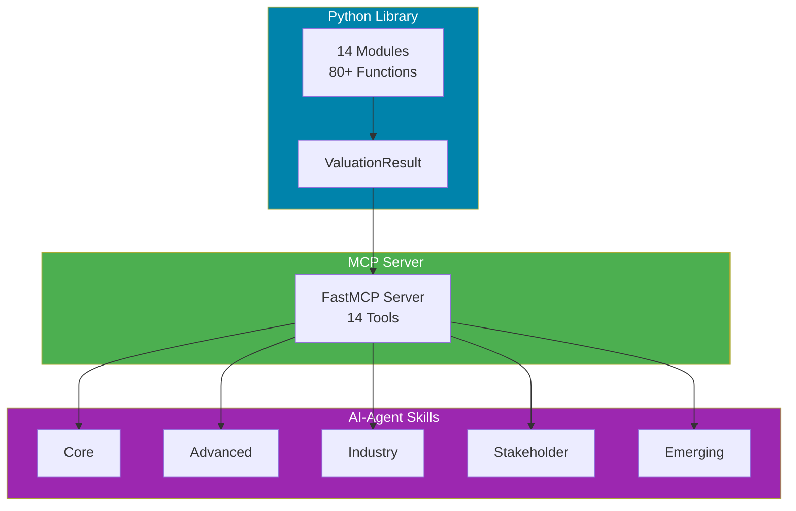

# Startup Valuation Engine

<!-- mcp-name: io.github.simonplmak-cloud/startup-valuation -->

> Comprehensive startup valuation library implementing **80+ formulas** from the *Startup Valuation* textbook. Python library + MCP server + AI-agent skills.

[](https://github.com/simonplmak-cloud/startup-valuation/actions/workflows/ci.yml)
[](https://pypi.org/project/startup-valuation/)
[](https://opensource.org/licenses/MIT)
[](https://www.python.org/downloads/)
[](https://github.com/simonplmak-cloud/startup-valuation/actions/workflows/ci.yml)
[](https://simonplmak-cloud.github.io/startup-valuation/)
[](https://startup-valuation.simonmak.com/api)
[](https://scorecard.dev/viewer/?uri=github.com/simonplmak-cloud/startup-valuation)
[](https://glama.ai/mcp/servers/simonplmak-cloud/startup-valuation)

## Overview

A production-grade Python library for startup valuation, implementing every formula from the **[Startup Valuation](https://www.amazon.com/Startup-Valuation-Comprehensive-Fast-Growing-Pre-Revenue-ebook/dp/B0FYTGNVWS/)** textbook by Simon Mak (Valuation in Practice Series, Ascent Partners). Designed for developers, financial analysts, and AI agents who need auditable, structured valuation computations.

**Three-layer architecture:**



1. **Python Library** — 14 modules, 80+ typed functions, all returning `ValuationResult` (value + assumptions + sensitivity)
2. **MCP Server** — 14 folded tools (80+ formulas) for AI agents via stdio and hosted Streamable HTTP
3. **AI-Agent Skills** — 6 skill definitions with workflow guidance for valuation domains

## Installation

```bash
pip install startup-valuation          # library only
pip install startup-valuation[mcp]     # + MCP server
pip install startup-valuation[dev]     # + pytest, ruff, mypy
```

## Quick Start

### Python Library

```python
from startup_valuation.core import scorecard_valuation, vc_method_post_money
from startup_valuation.advanced import black_scholes, scenario_analysis
from startup_valuation.types import Scenario

# Scorecard Method (pre-revenue startups)
result = scorecard_valuation(
    average_valuation=1_500_000,
    weights=[0.30, 0.25, 0.15, 0.10, 0.10, 0.05, 0.05],
    scores=[1.25, 1.50, 1.20, 0.75, 1.00, 0.90, 1.00],
)
print(f"Scorecard: ${result.value:,.0f}")  # $1,800,000

# Black-Scholes for real options (startup equity)
result = black_scholes(
    underlying=20_000_000, strike=5_000_000,
    risk_free_rate=0.05, volatility=0.40, time_to_maturity=1.0,
)
print(f"Option value: ${result.value:,.0f}")  # $15,240,000

# Scenario Analysis
scenarios = [
    Scenario("bull", 0.20, 10_000_000),
    Scenario("base", 0.60, 5_000_000),
    Scenario("bear", 0.20, 1_000_000),
]
result = scenario_analysis(scenarios)
print(f"Expected value: ${result.value:,.0f}")  # $5,200,000
```

### MCP Server (for AI Agents)

The server exposes **14 tools**, each folding a family of formulas behind a `method`
argument — probability, time value, CAPM, core pre-revenue methods, options,
comparables, SaaS, marketplaces, fintech, biotech, hardware, international,
stakeholder equity, emerging methods, and a triangulated full analysis.

**Local (stdio):**

```bash
pip install "startup-valuation[mcp]"
startup-valuation-mcp          # console script installed with the [mcp] extra

**Prompts and resources.** Besides the 14 tools, the server offers three guided
prompts (`value_pre_revenue_startup`, `value_saas_startup`, `model_funding_round`)
and a machine-readable method catalog at `startup-valuation://methods`, so agents
can see every method's required parameters before calling a tool.

# or: python -m startup_valuation.mcp
# or ephemeral, no clone: uvx --from startup-valuation startup-valuation-mcp
```

**Hosted (Streamable HTTP)** — no install, no API key:

```
https://startup-valuation.simonmak.com/api
```

**OpenCode** — add to `opencode.json`:

```json
"startup-valuation": {
  "type": "remote",
  "url": "https://startup-valuation.simonmak.com/api",
  "timeout": 60000
}
```

**Claude Desktop / Cursor** — add the HTTP URL `https://startup-valuation.simonmak.com/api`
as an MCP server, or run the stdio entrypoint above.

**MCP Registry** — published as `io.github.simonplmak-cloud/startup-valuation`
(manifest: [`server.json`](server.json)) and listed on
[Glama](https://glama.ai/mcp/servers/simonplmak-cloud/startup-valuation) and the
[Official MCP Registry](https://registry.modelcontextprotocol.io). The
[`glama.json`](glama.json) file holds the Glama maintainer entry.

### AI-Agent Skills

Copy the `skills/` directory to your agent's skills folder:

- **`valuation-core`** — Scorecard, Berkus, VC Method, Risk Factor Summation
- **`valuation-foundations`** — Probability, time value, CAPM, comparables
- **`valuation-advanced`** — Black-Scholes, Binomial, Monte Carlo, Scenario Analysis
- **`valuation-industry`** — SaaS, Biotech, Fintech, Marketplace, Hardware
- **`valuation-stakeholder`** — Dilution, OPM, PWERM, Liquidation Preference
- **`valuation-emerging`** — SAFE, Crypto (MV=PQ), ESG, Metcalfe's Law

## Valuation Methods by Category

| Category          | Methods                                            | Chapter |
| ----------------- | -------------------------------------------------- | ------- |
| **Probability**   | Expected value, joint probability, Poisson         | 2       |
| **Time Value**    | PV, NPV, annuity                                   | 2       |
| **CAPM**          | CAPM, portfolio beta, startup-adjusted             | 2       |
| **Core**          | Scorecard, Berkus, Risk Factor, VC Method          | 3       |
| **Advanced**      | Black-Scholes, Binomial, Monte Carlo, Scenario     | 4       |
| **Comparables**   | P/E, P/S, EV/EBITDA, regression-adjusted           | 5       |
| **SaaS**          | LTV, CAC, NRR, Magic Number, Rule of 40            | 11      |
| **Biotech**       | rNPV, decision tree, peak sales, pipeline          | 11      |
| **Fintech**       | Payment revenue, lending, neobank, network effects | 11      |
| **Marketplace**   | GMV, take rate, liquidity, network density         | 11      |
| **Hardware**      | TRL-adjusted, break-even, P-weighted DCF           | 11      |
| **International** | PPP, CRP, currency-adjusted DCF, Damodaran         | 12      |
| **Stakeholders**  | Dilution, OPM, PWERM, liquidation, synergies       | 13      |
| **Emerging**      | SAFE, MV=PQ, ESG, Metcalfe's, data moat            | 14      |

## Why This Library?

- **Auditable** — Every function returns `ValuationResult` with value, method, inputs, assumptions, and sensitivity analysis
- **Textbook-accurate** — All formulas verified against book example values with unit tests
- **AI-ready** — MCP server and Skills for seamless AI agent integration
- **Industry-specific** — Dedicated modules for SaaS, biotech, fintech, marketplace, and hardware startups
- **Open source** — MIT license, extensible, well-documented

## Development

```bash
# Install dev dependencies
pip install -e ".[dev]"

# Run tests
pytest

# Run with coverage
pytest --cov=startup_valuation --cov-report=term-missing

# Lint
ruff check .

# Type check
mypy src/startup_valuation --ignore-missing-imports
```

## Documentation

- **API Reference:** [GitHub Pages](https://simonplmak-cloud.github.io/startup-valuation/)
- **Wiki (Theory & Derivations):** [GitHub Wiki](https://github.com/simonplmak-cloud/startup-valuation/wiki)
- **PyPI:** [pypi.org/project/startup-valuation](https://pypi.org/project/startup-valuation/)
- **Chapter Index:** Maps every function to its textbook chapter
- **Examples:** Interactive code snippets for each valuation category

## Companion Textbook

**[Startup Valuation: A Comprehensive Guide to Valuing Fast-Growing Pre-Revenue Companies](https://www.amazon.com/Startup-Valuation-Comprehensive-Fast-Growing-Pre-Revenue-ebook/dp/B0FYTGNVWS/)**  
_Theory, Methods, Regulation, and Practice_ — Valuation in Practice Series by Ascent Partners  
By Simon Mak · 338 pages · 15 chapters · 300+ exercises · 20+ real-world cases

## Citing This Project

```bibtex
@software{startup_valuation_engine,
  author = {Mak, Simon},
  title = {Startup Valuation Engine},
  year = {2026},
  url = {https://github.com/simonplmak-cloud/startup-valuation},
  license = {MIT},
}
```

Based on formulas from the **Startup Valuation** textbook.

## Use with Context7

Up-to-date Startup Valuation Engine documentation is indexed on [Context7](https://context7.com/simonplmak-cloud/startup-valuation), so coding agents can pull it into context on demand. With the Context7 MCP server or `ctx7` CLI installed, name the library in your prompt:

```text
use library /simonplmak-cloud/startup-valuation for API and docs
```

## License

MIT — see [LICENSE](LICENSE).

---

If this saves you time, a ⭐ on GitHub helps others find it.
